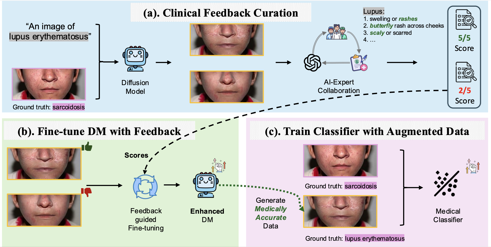

# Doctor Approved: Generating Medically Accurate Skin Disease Images through AI–Expert Feedback

<a href="https://arxiv.org/abs/2506.12323">
  
</a>
<a href="#">
  
</a>

---

Official code for the paper [Doctor Approved: Generating Medically Accurate Skin Disease Images through AI–Expert Feedback](https://arxiv.org/pdf/2506.12323). Our work is accepted to NeurIPS 2025! This repository adapts components from [D3PO](https://github.com/yk7333/d3po) and [skin-diff](https://github.com/janet-sw/skin-diff). 


Overall, the MAGIC framework illustrates a task-centric alignment paradigm: instead of adapting MLLMs to niche medical tasks, it adapts tasks to the evaluative strengths of general-purpose MLLMs by decomposing domain knowledge into attribute-level checklists. This alignment is particularly valuable given that the most powerful MLLMs are often proprietary, and training domain-specific MLLMs is costly. This design offers a scalable and reliable path for leveraging foundation models in specialized domains, beyond dermatological image synthesis.




# 1. Requirements

Python 3.10 or a newer version is required to install the necessary dependencies.

```bash
# Create and activate a fresh environment
conda create -n magic
conda activate magic

# Clone and install
git clone https://github.com/janet-sw/MAGIC.git
cd MAGIC
pip install -e .
```


# 2. Preliminary Training

Before implementing the MAGIC pipeline proposed in the work, we pre-train a Stable Diffusion model so it learns lesion semantics. We adapt this step from [skin-diff](https://github.com/janet-sw/skin-diff). See paper **§ 3.2 Preliminary Diffusion Models Fine-tuning** for more details. 

Run the Notebook `notebooks/preliminary_dm_ft.ipynb` for this step. 

Output: LoRA weights used as the starting point for DPO alignment.


# 3. MAGIC-DPO Training

Once preliminary training is finished, we should have LoRA weights for DPO training. We used `accelerate` to facilitate distributed training. Prior to executing our code, it is essential to configure the settings for `accelerate`:

```bash
accelerate config
```

Choose settings appropriate for your machine (single GPU or distributed).


## 3.1 Sampling

The MAGIC-DPO training consists of two steps: sampling and training. First, run this command to generate image samples:

```bash
accelerate launch scripts/sample.py
```

The above command will generate image samples and save information such as each image's latent representation and prompt. Set the output directory by editing `save_dir` in `scripts/sample.py`. 

Note that the total number of images generated per epoch is `sample.batch_size * num_gpus * sample.num_batches_per_epoch`. Adjust the hyperparameters in `config/base.py` under "Pretrained Model" and "Sampling" sections.


## 3.2 DPO Training

After collecting human feedback and organizing it into a JSON file, you'll need to modify *sample_path* in `config/base.py` to the directory containing the image samples and adjust *json_path* to the directory of the JSON file under the "Training" section. Then, lacunch training:

```
accelerate launch scripts/train.py
```


# 4. Inference

After aligning the diffusion model, we can start synthesizing images with the aligned model. Use the aligned diffusion model for image synthesis via `notebooks/inference_img2img.ipynb` for this step. 


# Citation

If you find this work helpful, please consider citing:

```
@inproceedings{wang2025doctor,
  title={Doctor Approved: Generating Medically Accurate Skin Disease Images through AI-Expert Feedback},
  author={Wang, Janet and Zhang, Yunbei and Ding, Zhengming and Hamm, Jihun},
  booktitle={NeurIPS},
  year={2025}
}
```
